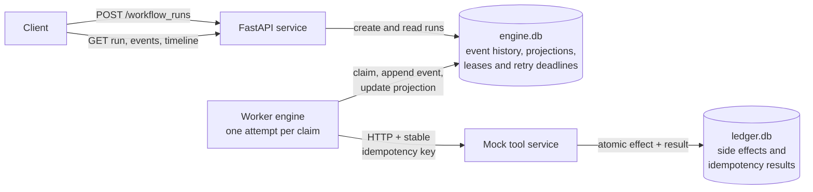

# Crashsafe

Crashsafe is a small Python/FastAPI durable workflow engine. A client submits a
fully materialized JSON workflow definition to create a run; local workers
execute its allowlisted tool calls while SQLite preserves enough history to
resume the run after arbitrary process death.

The guarantee is intentionally precise: Crashsafe provides durable recovery and
**at-least-once tool requests**. An external effect happens exactly once only
when the tool durably deduplicates Crashsafe's stable idempotency key.

## What I built—and cut

Built:

- Crash-safe resume after real `kill -9`, including the ambiguous window where
  the tool committed but the worker did not record the response.
- Safe retries with persisted exponential backoff and provider `Retry-After`.
- A configurable local worker pool with renewable run leases and monotonic
  fence tokens (`CRASHSAFE_WORKERS=2` in the demo).
- Graceful `SIGTERM`/`SIGINT` drain: stop claiming, finish one in-flight
  attempt, commit it, then exit.
- An append-only typed event history and atomically updated scheduling
  projections, plus history-derived timelines.
- A separate flaky mock tool whose side effect and idempotency result commit in
  one durable SQLite transaction.
- Validated JSON DAGs with `charge`, `provision`, and `notify` operations,
  explicit dependencies, deterministic ready-step ordering, and fail-fast runs.

Cut: arbitrary workflow code/replay, templates and expression parsing, dynamic
fan-out, intra-workflow parallelism, compensation, cancellation, distributed
consensus/storage, remote queues, authentication, tracing infrastructure, and a
UI. One run lease intentionally serializes ready branches; workers still
process different runs concurrently. Temporal is discussed only as design
context—it is not a dependency or experiment in this submission.

## AI usage

AI performed the implementation: it wrote the application and tests, enumerated
crash windows, scaffolded the typed boundaries, built the event reducer and
process harnesses, and drafted the documentation. The most important human work
was steering. Left unguided, AI repeatedly made plausible local choices that
pulled the project away from the right submission:

- **Scope:** it initially treated project memory as a runtime CRUD feature and
  later expanded into experiments that did not strengthen the take-home.
- **Event history:** it needed direction on why the append-only history is
  the durable source of truth, which facts belong in it, and where a projection
  is sufficient instead of more infrastructure.
- **Workflow definition:** it moved between a hard-coded sequence, a Python-like
  dynamic model, and a general DAG before human review selected a small,
  validated JSON definition that demonstrates two useful workflows without
  making parsing the project.
- **Demo:** it overbuilt multiple demos and a Temporal experiment before review
  focused the submission on one terminal recording that visibly proves
  ambiguous-outcome recovery and a deduplicated side effect.
- **Build tooling:** it retained a conventional `pip`/Make-based workflow and
  `Makefile` until human review chose `uv` for a faster, smaller setup.

AI also introduced implementation defects: Python 3.10 union syntax despite
Python 3.9 support, a connection-local SQLite durability pragma applied only at
setup, and lease deletion that could reuse fencing tokens. These were caught by
rereading the assignment, reviewing the data model and transaction boundaries,
running strict typing and repeated tests, inspecting SQLite state, using
deterministic barriers and clocks, exercising stale-owner cases, and sending real
process signals.

AI was extremely helpful: its raw implementation speed made the breadth of this
project possible within the available time. Human supervision is what made that
speed effective. It was needed to define the actual problem, reject attractive
extra scope, choose the durability model and interface, and decide what evidence
would make the guarantee credible. The result came from combining rapid AI
execution with deliberate human product and architectural judgment.

## Key decisions

### Execution model



The two databases are separate transaction domains. There is deliberately no
transaction across HTTP: the engine makes the request at least once, while the
tool's durable idempotency record makes repeating the side effect safe.

`POST /workflow_runs` validates the entire concrete definition with Pydantic and
graph checks. In one `BEGIN IMMEDIATE` transaction it appends
`WorkflowRunCreated` v3 and inserts the run, step, and dependency projections.
The event snapshots the definition name, ordered steps, dependencies, concrete
requests, tool identity, and server-generated keys. Recovery therefore needs no
definition registry or source JSON file.

Workers atomically claim a run, then handle one synchronous tool attempt.
Different runs can overlap. Reacquiring an expired lease
increments its fence token; every worker-originated state commit checks the
current owner and token. SQLite uses WAL mode and `synchronous=FULL` on every
connection, and no database transaction spans network I/O.

### State machine and invariants

```text
pending ──persist intent──► intent_recorded ──success──► completed
                                │
                                ├──retryable──► retry_wait ──deadline──┐
                                └──permanent/exhausted──► failed       │
                                              ▲────────────────────────┘
```

Core invariants:

1. Intent, concrete request, attempt number, and stable operation key commit
   before a request leaves the worker.
2. A key is always `{run_id}:{client_step_id}` and never changes across
   retry, restart, or lease takeover.
3. A step is claimable only after every declared dependency completed; array
   position deterministically breaks ties between ready steps.
4. Each transition event and its mutable projection update share one SQLite
   transaction. Ordered history can reconstruct the projection exactly.
5. The final step completion and `WorkflowRunCompleted` commit atomically.
6. Only the current unexpired fence can commit worker results. This guarantees
   one valid committing owner, not exactly-once compute.
7. The tool atomically records its side effect and cached idempotency response.
   A same-key/different-payload request is rejected.

The calls I am least sure about are wall-clock leases (appropriate locally, not
a multi-host consensus substitute) and a conservative tool-wide cooldown (one
429 temporarily gates every run using that tool).

## Failure modes

| Worker dies exactly… | Durable state and recovery | Why correct |
|---|---|---|
| Before the intent transaction commits | Step remains `pending`; another owner starts attempt 1. | No request was authorized by visible durable state. |
| After intent commits, before HTTP send | An unmatched attempt remains; after lease expiry, a higher fence records another attempt with the same key. | A needless repeat is harmless at the idempotent tool. |
| After the tool commits charge, before the response is recorded | `ledger.db` has one effect and cached result; engine history has an unmatched attempt. Recovery repeats the same key and receives that result. | Effect and idempotency result committed atomically. This is the demo's `kill -9` point. |
| After the old lease expires while its call is still running | A replacement owns a higher fence. The stale engine commit is rejected. | Fencing protects engine state; the stable key protects the external effect. |
| During or after the completion transaction | An uncommitted event/projection pair rolls back together; a committed pair is skipped on restart. | No half-transition is visible, and completed steps never reopen. |

An unmatched attempt means the outcome is **unknown**, not that delivery did or
did not happen. Idempotency makes both possible worlds safe.

## API and workflow definition

The repository includes complete
[`paid-onboarding`](workflows/paid-onboarding.json) and
[`trial-activation`](workflows/trial-activation.json) definitions. These files
are authoring examples, not a server-side registry; every created run owns an
immutable snapshot of the submitted definition.

| Method | Route | Purpose |
|---|---|---|
| `POST` | `/workflow_runs` | Validate a definition and create one durable run. |
| `GET` | `/workflow_runs` | List runs, newest first. |
| `GET` | `/workflow_runs/{run_id}` | Read the run and its projected step state. |
| `GET` | `/workflow_runs/{run_id}/events` | Read its ordered append-only history. |
| `GET` | `/workflow_runs/{run_id}/timeline` | Read history-derived retry and execution timing. |
| `GET` | `/healthz` | Check API availability. |

The independent mock service exposes `GET /ledger`; pass `run_id` to count only
the side effects created by that workflow run, or omit it for cumulative totals.

The following manual test exposes the recovery boundary instead of letting the
stack supervisor restart the worker immediately. Run `uv sync` first, then start
only the API and mock tool in Terminal 1 against a persistent scenario directory:

```bash
uv sync
export CRASHSAFE_STATE_DIR=.crashsafe
mkdir -p "$CRASHSAFE_STATE_DIR"
CRASHSAFE_FLAKY_RATE=0 uv run crashsafe-mock-tool >"$CRASHSAFE_STATE_DIR/tool.log" 2>&1 &
TOOL_PID=$!
uv run crashsafe-api >"$CRASHSAFE_STATE_DIR/api.log" 2>&1 &
API_PID=$!
sleep 1
kill -0 "$API_PID" "$TOOL_PID" || {
  cat "$CRASHSAFE_STATE_DIR/api.log" "$CRASHSAFE_STATE_DIR/tool.log"
  echo "Startup failed; stop any process already using ports 8000 or 8001."
}
for _ in {1..50}; do
  curl -fsS http://127.0.0.1:8000/healthz >/dev/null && \
    curl -fsS http://127.0.0.1:8001/healthz >/dev/null && break
  sleep 0.2
done
curl -fsS http://127.0.0.1:8000/healthz >/dev/null
curl -fsS http://127.0.0.1:8001/healthz >/dev/null
```

In Terminal 2 (with `jq` installed), first confirm there is no older unfinished
run. Because workers intentionally resume the oldest eligible persisted work,
recover or explicitly remove stale state before continuing; otherwise the worker
may correctly execute that older run first.

```bash
curl -sS http://127.0.0.1:8000/workflow_runs |
  jq -e '[.[] | select(.status == "running")] | select(length == 0)'
```

Then submit a run and start one worker whose
charge response is delayed after the tool commits. Kill that worker at the
ambiguous point, then print the still-running timeline and only this run's
committed side effects:

```bash
export CRASHSAFE_STATE_DIR=.crashsafe
API_URL=http://127.0.0.1:8000
TOOL_URL=http://127.0.0.1:8001
RUN_ID=$(curl -sS -X POST "$API_URL/workflow_runs" \
  -H 'content-type: application/json' \
  --data-binary @workflows/paid-onboarding.json | jq -r '.run_id')

rm -f "$CRASHSAFE_STATE_DIR/worker.pid"
CRASHSAFE_DELAY_AFTER_TOOL_COMMIT=charge \
CRASHSAFE_REQUEST_TIMEOUT=60 \
CRASHSAFE_WORKER_PID_FILE="$CRASHSAFE_STATE_DIR/worker.pid" \
uv run crashsafe-worker >"$CRASHSAFE_STATE_DIR/worker.log" 2>&1 &
WORKER_JOB=$!

for _ in {1..50}; do
  [[ -s "$CRASHSAFE_STATE_DIR/worker.pid" ]] && break
  sleep 0.1
done
[[ -s "$CRASHSAFE_STATE_DIR/worker.pid" ]] || {
  cat "$CRASHSAFE_STATE_DIR/worker.log"
  echo "Worker did not start."
}
WORKER_PID=$(<"$CRASHSAFE_STATE_DIR/worker.pid")
echo "Waiting for this run's charge to commit..."
CHARGES=0
for _ in {1..100}; do
  CHARGES=$(curl -fsS "$TOOL_URL/ledger?run_id=$RUN_ID" | jq -r '.charges')
  (( CHARGES > 0 )) && break
  sleep 0.1
done
[[ "$CHARGES" == 1 ]] || {
  cat "$CRASHSAFE_STATE_DIR/worker.log"
  echo "Charge did not commit exactly once within 10 seconds."
}

kill -9 "$WORKER_PID"
wait "$WORKER_JOB" 2>/dev/null || true
curl -sS "$API_URL/workflow_runs/$RUN_ID/timeline" | jq .
curl -sS "$TOOL_URL/ledger?run_id=$RUN_ID" | jq .
```

Back in Terminal 1, stop the inspection-only API and tool, then restart the
complete server against the same database. Its replacement worker automatically
discovers the unfinished run:

```bash
kill "$API_PID" "$TOOL_PID"
wait "$API_PID" "$TOOL_PID" 2>/dev/null || true
CRASHSAFE_STATE_DIR=.crashsafe \
CRASHSAFE_FLAKY_RATE=0 uv run crashsafe-stack
```

Finally, in Terminal 2, wait for the run to become terminal, then print only its
completed timeline and run-scoped ledger counts:

```bash
echo "Waiting for recovery to finish..."
STATUS=running
for _ in {1..100}; do
  STATUS=$(curl -fsS "$API_URL/workflow_runs/$RUN_ID" | jq -r '.status')
  [[ "$STATUS" != "running" ]] && break
  sleep 0.2
done
[[ "$STATUS" == completed ]] || {
  curl -sS "$API_URL/workflow_runs/$RUN_ID/timeline" | jq .
  echo "Run did not complete within 20 seconds; inspect the stack logs above."
}

curl -sS "$API_URL/workflow_runs/$RUN_ID/timeline" | jq .
curl -sS "$TOOL_URL/ledger?run_id=$RUN_ID" | jq .
```

## Demo

Requires Python 3.9+:

```bash
uv sync
uv run python scripts/demo.py
```

The sole demo creates two runs. Worker 1 starts a charge and remains blocked
after the tool durably commits it. While that request is still in flight,
worker 2 starts the independent trial run, receives HTTP 429, and durably
schedules the provider's two-second `Retry-After`. The demo then executes a real
`kill -9` against worker 1.

Immediately after SIGKILL, it prints both history-derived timelines: the paid
run has an unmatched charge attempt with an unknown outcome, while the trial
run has a persisted retry deadline. It then starts one replacement worker,
prints both completed timelines, and passes only when the retry waited as
directed and that invocation adds exactly **one charge, two provisions, and
three notifications**. The brief overlap between workers 1 and 2 also exercises
leased concurrent execution without making concurrency a separate demo.

[Watch the terminal demo](crashsafe-demo.mp4).

## Focused manual check: graceful drain

The crash-resume, safe-retry, concurrency, and observability properties are
covered together by the canonical demo. Graceful drain is mutually exclusive
with SIGKILL, so one self-contained script demonstrates it separately. The
script starts isolated services, sends SIGTERM during a committed charge call,
shows the drained state, restarts processing, prints both timelines, and verifies
one charge attempt and exactly one charge:

```bash
uv sync
uv run python scripts/graceful_drain.py
```

No application or scenario startup deletes SQLite state. By default,
`crashsafe-stack`, both scenario scripts, and the manual walkthrough all append
to the same global `.crashsafe/engine.db` and `.crashsafe/ledger.db`. Stop any
running Crashsafe processes before launching a self-contained scenario. Repeated
runs verify only the side effects added by that invocation rather than assuming
an empty ledger. If an earlier invocation left unfinished runs, recover them or
clear `.crashsafe` manually before retrying.

`engine.db` is the workflow engine's durable database: it contains submitted
definitions, append-only event histories, scheduling projections, leases, and
retry deadlines. `ledger.db` belongs only to the mock tool and contains its
idempotency results and side-effect ledger.
Keeping these as separate SQLite databases preserves the real network ambiguity;
there is no transaction shared between engine state and external effects. On
first startup, a legacy `tools.db` is renamed to `ledger.db` without discarding
its contents. `CRASHSAFE_ENGINE_DB` and `CRASHSAFE_LEDGER_DB` can override the
two paths explicitly.
